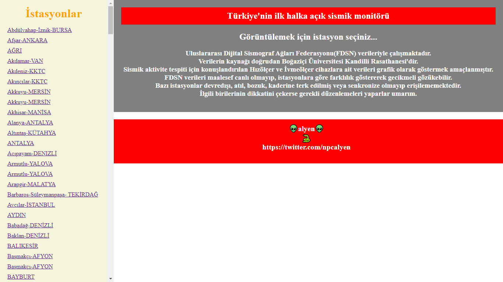
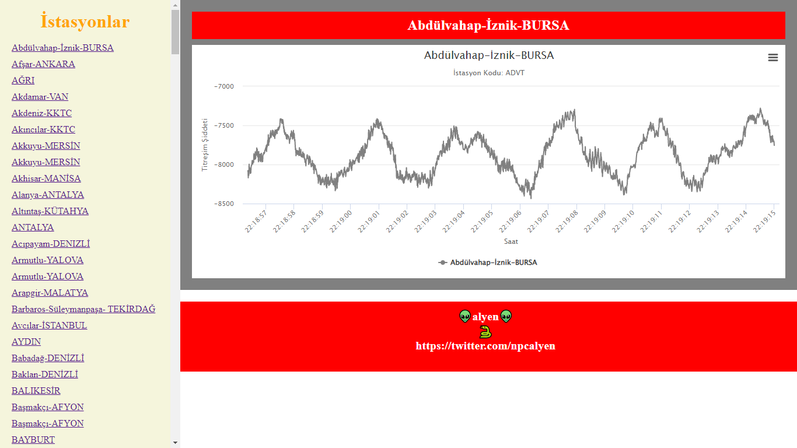

# Sismograf

Türkiye'nin ilk ve tek halka açık sismik aktivite monitörü.

## Açıklama 🕯️

Verilerin kaynağı doğrudan Boğaziçi Üniversitesi Kandilli Rasathanesi'dir.
Uluslararası Dijital Sismograf Ağları Federasyonu (FDSN) miniseed (mseed) verileriyle çalışmaktadır. Yaklaşık 300 adet Hızölçer ve İvmeölçer cihazların verilerini grafik olarak sismograf şeklinde görüntülenmesi amaçlanmıştır. Türünün tek örneği olup, Dünya'da dahil herhangi bir ülkeden bir kişi çıkıp benzer bir uygulama yapmamıştır.
Faydalanılan [sismik Ağ Listesi](http://www.koeri.boun.edu.tr/sismo/2/sismik-ag/sismik-ag-listeleri/)
[mseed](http://www.koeri.boun.edu.tr/sismo/2/deprem-verileri/sayisal-veriler/veri-indirme-miniseed/)

```
## Kullanım 🚀
localhost'da geliştirilmiş ve test edilmiştir.

~ Malzemeler 🤖
* Python 🐍
* Flask
* Obspy

```

##


## Yapan-eden

👽 [Alyen](https://twitter.com/npcalyen) 🐍

## 
